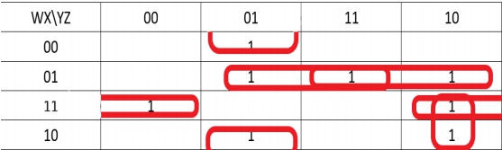
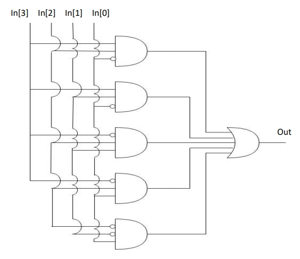
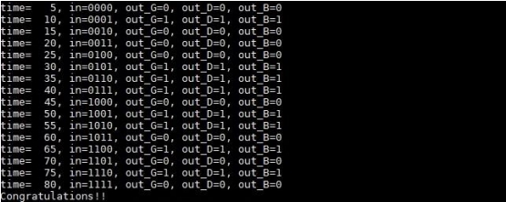

# K-Map Structure and Truth Table

## Truth Table
| W | X | Y | Z |Result|
|:-:|:-:|:-:|:-:|:----:|
| 0 | 0 | 0 | 0 | 0    |
| 0 | 0 | 0 | 1 | 1    |
| 0 | 0 | 1 | 0 | 0    |
| 0 | 0 | 1 | 1 | 0    |
| 0 | 1 | 0 | 0 | 0    |
| 0 | 1 | 0 | 1 | 1    |
| 0 | 1 | 1 | 0 | 1    |
| 0 | 1 | 1 | 1 | 1    |
| 1 | 0 | 0 | 0 | 0    |
| 1 | 0 | 0 | 1 | 1    |
| 1 | 0 | 1 | 0 | 1    |
| 1 | 0 | 1 | 1 | 0    |
| 1 | 1 | 0 | 0 | 1    |
| 1 | 1 | 0 | 1 | 0    |
| 1 | 1 | 1 | 0 | 1    |
| 1 | 1 | 1 | 1 | 0    |

## K-Map

1. 第一行第三列 1100 和第四行第三列 1110 可合併為 WXZ’
2. 第二行第一列 0001 和第二行第四列 1001 可合併為 X’Y’Z
3. 第二行第二列 0101 和第三行第二列 0111 可合併為 W’XZ
4. 第三行第二列 0111 和第四行第二列 0110 可合併為 W’XY
5. 第四行第三列 1110 和第四行第四列 1010 可合併為 WYZ’

### 結論
WXZ’ + WYZ’ + W’XY + W’XZ + X’Y’Z

將上述結果畫成架構圖

    W=In[3], X=In[2], Y=In[1], Z=In[0]

 

# 模擬結果

# 問題討論 
Verilog 跟之前寫的程式有點像但又有很多不同之處像是
1. 雖然也有 for 迴圈跟 if 表述，但是前後要加上 begin 跟 end，而且並沒有
i++這種寫法
2. Reg, wire, assign 到現在還是蠻混亂的，有上網查到說若變數放在 begin …
end 內就必須用 reg，在其之外的地方就必須使用 wire。且 reg 具有記憶
功能，wire 則是一條線路跑過並無記憶功能