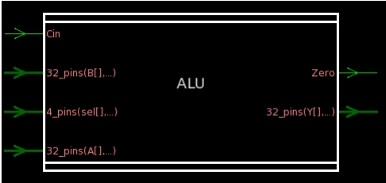
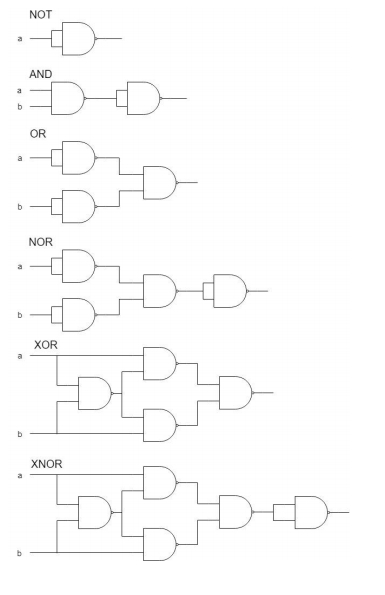
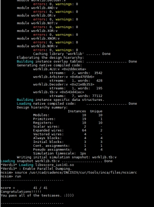
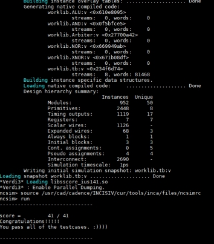

# ALU
[Problem](Problem.md)


此次電路設計為實作 ALU，其中主要有幾個 module 要實作




1. 一般邏輯的 module
只使用 nand gate 去實作所有邏輯的 gate


2. Arbiter
運用 case 一層層去找出第一個出現 1 的時候
※這裡的 case 要加上一個 x，底下才可以用 x 去代表 0 或 1
3. Decoder
4. ALU
為讀取 input 並判斷要用到的 module 再把 output 的值回傳
其中 shift 分為兩種

```
    logic shift
    arithmetic shift
```

兩種 shift 的差別在 logic shift 在左移或是右移時都是由 0 補上空缺的 bit
Arithmetic shift 在左移也是補 0，但右移是由 MSB 補上

因此兩者在左移的情況下是一樣的，但右移有些許不同
這樣的差異造就了兩者使用的情況不同

    ※右移的情況下
    logic shift 永遠補 0，在判讀上永遠為正，因此用在 unsigned binary number
    arithmetic shift 會記錄其原本 MSB，因此用在 2’s complement binary number


# Ncverilog Result



# Synthesis Result


# Report Area
****************************************
Report : area<br>
Design : ALU<br>
Version: K-2015.06-SP1<br>
Date : Sat Apr 13 15:31:38 2019<br>
****************************************
Library(s) Used:

    slow (File: /theda21_2/CBDK_IC_Contest/cur/SynopsysDC/db/slow.db)

Number of ports: 329<br>
Number of nets: 1414<br>
Number of cells: 950<br>
Number of combinational cells: 940<br>
Number of sequential cells: 0<br>
Number of macros/black boxes: 0<br>
Number of buf/inv: 167<br>
Number of references: 35<br>
Combinational area: 12469.100507<br>
Buf/Inv area: 760.435188<br>
Noncombinational area: 0.000000<br>
Macro/Black Box area: 0.000000<br>
Net Interconnect area: undefined (No wire load specified)<br>
Total cell area: 12469.100507<br>
Total area: undefined
****************************************