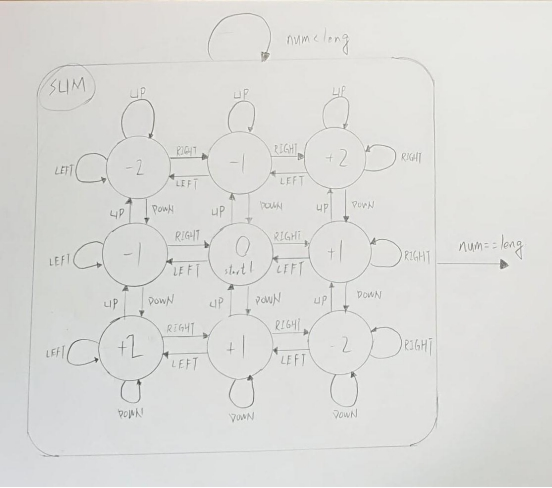
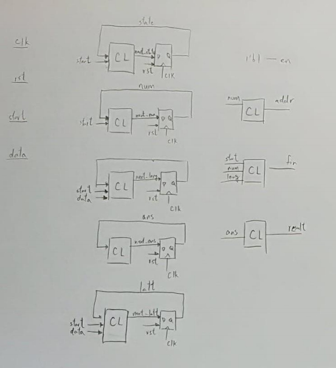
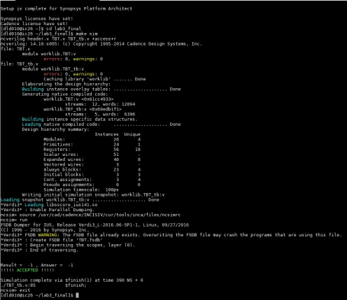
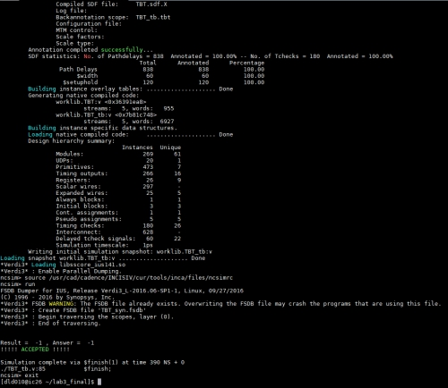
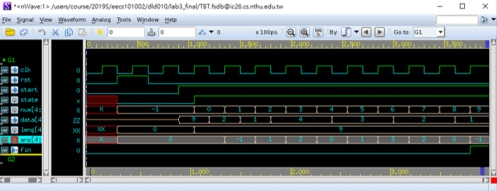

# Path Sum
[Problem](Problem.md)

## Design State Transition Graph

這次要做的是對路徑的加總 
除了助教提供的 IDLE 跟 SUM state 之外 
在 sum 裡再增加 9 個 state，分別代表九宮格的各個格子 
去接收 data 判斷下一個為哪個方向 
決定到哪一個 state(如上圖)

## Block Diagram

## Ncverilog Result

## Report Area
****************************************
Report : area 
Design : TBT 
Version: K-2015.06-SP1 
Date : Thu May 2 01:12:11 2019 
****************************************
Library(s) Used:

    slow (File:
    /theda21_2/CBDK_IC_Contest/cur/SynopsysDC/db/slow.db)
Number of ports: 188 
Number of nets: 436 
Number of cells: 269 
Number of combinational cells: 223 
Number of sequential cells: 22 
Number of macros/black boxes: 0 
Number of buf/inv: 24 
Number of references: 39 
Combinational area: 2021.603379 
Buf/Inv area: 84.869999 
Noncombinational area: 633.130184 
Macro/Black Box area: 0.000000 
Net Interconnect area: undefined (No wire load specified) 
Total cell area: 2654.733564 
Total area: undefined 
****************************************

 

## Report Clock
****************************************
Report : clocks 
Design : TBT 
Version: K-2015.06-SP1 
Date : Thu May 2 01:11:16 2019 
****************************************
Attributes: 
 d - dont_touch_network 
 f - fix_hold 
 p - propagated_clock 
 G - generated_clock 
 g - lib_generated_clock 

| Clock | Period | Waveform | Attrs | Sources |
|:-----:|:------:|:--------:|:-----:|:-------:|
|clk    |30.000  |{0 15}    |       |{clk}    |

 

## nWave

## 問題與討論
第一次寫 Sequential circuit，看助教給的 FSM 講義很久總算是看得有點
明白，也比較了解 Sequential circuit 的運作機制 
nWave 感覺是個很好用的東西，裡面所有訊號都顯示的一清二楚，用它來
Debug 很容易就能找到錯誤

