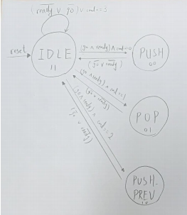
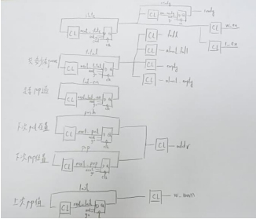

# Queue

## Design FSM

這次在設計時總共有 4 個 state
分別就是 cmd 前兩個數字所代表的指令
    
    PUSH(00) POP(01) PUSH_PREV(10) IDLE(11)

以 ready 跟 go 以及 cmd 判斷下個 state

 
 

而變數部分額外設了
1. state 用於紀錄 state
2. total 用於紀錄 queue 中數字總數
3. push 用於紀錄要 push 的位置
4. pop 用於紀錄要 pop 的位置
5. last_en 用於紀錄有無 pop 過
6. last 用於紀錄上次所 pop 的值

 

## Report Area
 
****************************************
Report : area 
Design : queue 
Version: K-2015.06-SP1 
Date   : Wed May 22 16:09:30 2019 
****************************************

Library(s) Used:

    slow (File: /theda21_2/CBDK_IC_Contest/cur/SynopsysDC/db/slow.db)

Number of ports:                           66 
Number of nets:                           233 
Number of cells:                          162 
Number of combinational cells:            120 
Number of sequential cells:                42 
Number of macros/black boxes:               0 
Number of buf/inv:                         10 
Number of references:                      30 

Combinational area:               1079.546393 
Buf/Inv area:                       37.342799 
Noncombinational area:            1327.366800 
Macro/Black Box area:                0.000000 
Net Interconnect area:      undefined  (No wire load specified) 

Total cell area:                  2406.913193 
Total area:                 undefined 
****************************************

 

## 問題與討論
1. 在設定 ready 的值時，原本是近 IDLE 就讓它歸 0，但是這樣會讓 error 來
不及被判斷就跑到下個指令，後來就另外設 next_ready 來記錄
2. 這次遇到一個問題就是在寫 error 得時候，因為一開始要將其設為 0，而
造成這個變數出現在兩個 always block 中，而因此造成在 design vision 時
無法開啟檔案，上網查是因為一個變數出現在兩個 always block 中是無法
以真實電路模擬出來的，後來解決辦法就是加設一個 next_error 來記錄